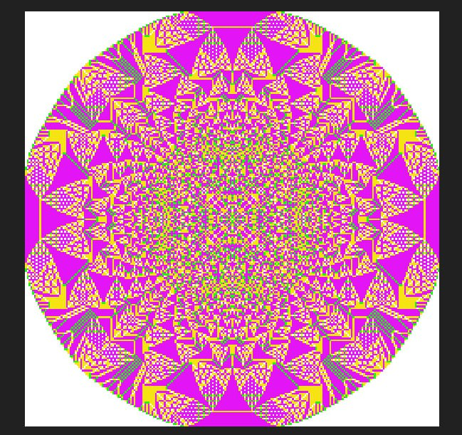

# abelian-sandpile-model

## Описание

Консольное приложение, реализуюшее упрощенную [модель песчаной кучи](https://en.wikipedia.org/wiki/Abelian_sandpile_model). Приложение может сохранять состояние модели в картинку в [формате BMP](https://en.wikipedia.org/wiki/BMP_file_format).

Изначальное состояние задается входным файлом.

Размер сетки может изменяться в процессе работы программы.

Консольное приложение поддерживает следующие аргументы командной строки:

  **-i, --input**    - [tsv-файл](https://en.wikipedia.org/wiki/Tab-separated_values) (tab-separated values) c начальными данными

  **-o, --output**   - путь к директории для сохранения картинок

  **-m, --max-iter** - максимальное количество итераций модели

  **-f, --freq**     - частота, с которой должны сохранятся картинки (если 0, то сохраняется только последнее состояние)

## Начальное состояние

Начальное состояние задается файлом со значением количества песчинок в каждой ячейке, кроме пустых. Размер сетки следует рассчитать на основании этих данных - минимальный прямоугольник в который попадают все ячейки.

Формат файла:
Каждая строчка содержит информацию об одной ячейке, в виде (x-координаты, y-координаты, количество песчинок), разделенных символом табуляции. 

## Примечания к модели

- Новые песчинки добавляются только при инициализации.

- Состояние следующего поколения ячеек зависит только от предыдущего состояния сетки.

- В случае если песчинки пытаются обвалиться за границу сетки, ее размер увеличивается на 1 в соответствующую сторону.

## Результат работы - программа

Программа пересчитывает состояние модели согласно начальным данным, а также сохраняет промежуточные состояния с заданной частотой в виде картинки в формате bmp.

Картинка для текущего состояния формируется по следующим правилам:

1. Размер картинки равен размеру поля.

2. Каждый пиксель соответствует ячейке поля.

3. Цвет пикселя зависит от количества песчинок в ячейке.

    + 0 - белый
    + 1 - зеленый
    + 2 - желтый
    + 3 - фиолетовый
    + \> 3 - черный

4. Кодирование 1 пикселя должно занимать не более 4 бит.

Программа заканчивает свою работу в случае если модель достигла стабильного состояния, либо номера заданной изначально итерации.

## Пример итогового изображения

